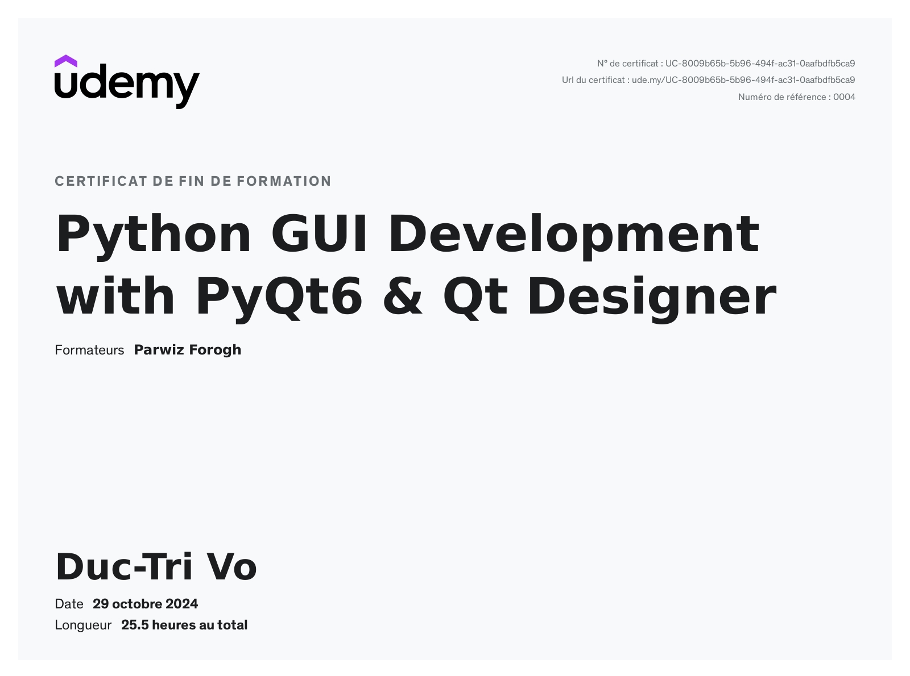

# Python GUI Development with PyQt6 & Qt Designer

Approximately 25.5 hours!

Verify link: [Udemy.com](https://www.udemy.com/certificate/UC-8009b65b-5b96-494f-ac31-0aafbdfb5ca9/)

### Learning objectives:
1. Introduction to PyQt6 and Installation Process  
2. Working with Qt Designer and building apps using Qt Designer  
3. Converting Qt Designer UI file to PY file  
4. Learning how to use different widgets and UI components with PyQt6 and Qt Designer  
5. Creating a simple Notepad application with PyQt6  
6. Connecting your PyQt6 application with a MySQL Database  
7. Drawing different shapes like rectangles, circles, and ellipses with PyQt6  
8. Working with QtQuick and QML (Qt Markup Language)  
9. Building different charts like PieChart, LineChart, BarChart, and DonutChart in PyQt6  
10. Creating a Library Management System using PyQt6, Qt Designer, and MySQL Database  
11. Converting PyQt PY file to an EXE file  
12. Making a stand-alone installer for your PyQt application
